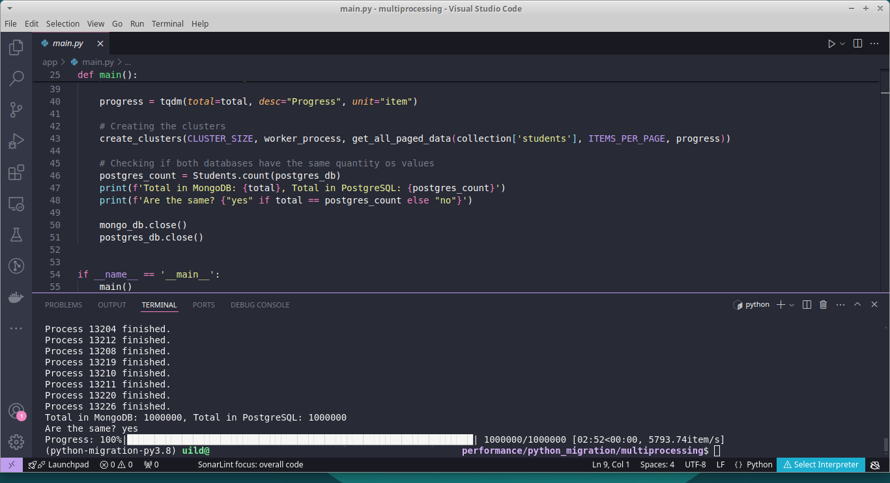

# Converting 1_000_000 MongoDB documents to PostgreSQL records in 3 minutes.

You'll need to install Docker and Docker compose to be able to run DBs instances
You'll also need python 3.8 version.

If you do not have poetry installed: 

    curl -sSL https://install.python-poetry.org | python3

Then, run:
	
    docker-compose up -d
    poetry shell
    poetry install
    python app/seed.py
    python app/main.py
    
    

